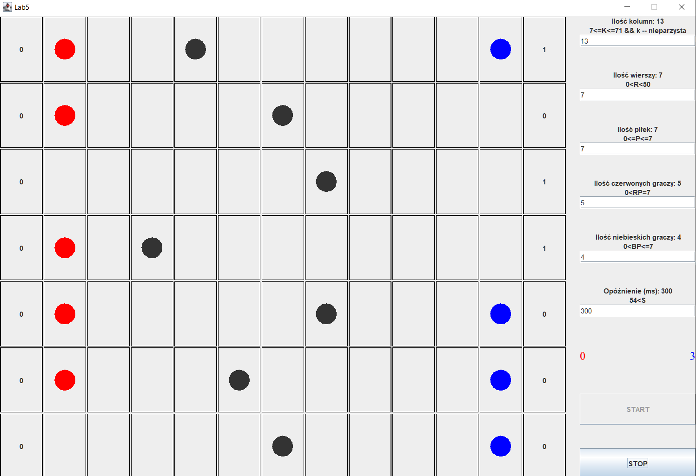

# Lab5-PingPongGame
Celem programu była nauka synchronizacji wątków w Javie, gdzie należało zaimplementować grę, która miała następujący charakter:
  - gra miała przedstawiać rywalizację pomiędzy 2 drużynami, w której każdy był obrońcą. Mieli oni za zadanie bronić swojego pola, aby piłka nie przedostała się przez końcową linie.
  - każdy gracz to osobny wątek,
  - każda piłka to osobny wątek,
  - spawner piłek, który znajdował się na środkowej kolumnie to również osobny wątek.

 * Kompilacja (Windows):
 * dir appgame /s /B *.java > sources.txt
 * javac @sources.txt
 *
 * Budowanie .jar:
 * jar cfm lab5_pop.jar ./META-INF/MANIFEST.MF *
 *
 * Uruchamianie:
 * java -jar lab5_pop.jar
 * (lub otworzyć z eksploratora)
